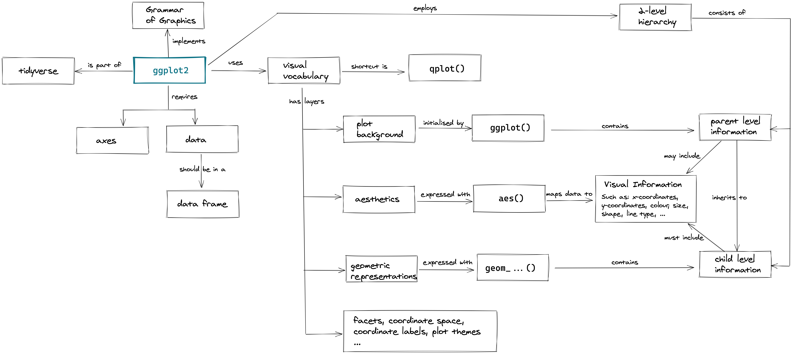

```{r setup, include=FALSE}
library(learnr)
library(tidyverse)
knitr::opts_chunk$set(echo = FALSE)
```


## Learner Persona

### Paula Postdoc
Paula just finished her PhD in Psychology and has a postdoc position in a new group at a different university. In her old lab she did everything with [SPSS](https://www.ibm.com/products/spss-statistics) and [Prism](https://www.graphpad.com/scientific-software/prism/). She was very impressed by Prism's graphing qualities, but sometimes wished for more control. Her new lab does not have licenses for those software solutions. Instead, because her supervisor strongly believes in supporting open source efforts, the group is using RStudio for their research. Paula still collaborates with colleagues from the old lab who do not know how to work with R. In her free time Paula is an amateur actress. She is a confident speaker and very social, but very scared to make mistakes and look 'stupid' in front of a class.

## Concept Map

### ggplot2-Basics

The class today is part of a 2-day intensive course (9am-5pm) and comes from the first morning. The sample class requires almost zero knowledge. The intensive course started with an extremely brief overview of R's syntax. So far the students only know that: 

1. tables can be represented as something called tibbles (they have seen the `mpg` data),
2. one can apply functions on tibbles (they have seen `filter(mpg, manufacturer == "volkswagen")`),
3. one can save objects to memory using the `<-` operator (they have seen `sml_mpg <- filter(mpg, manufacturer == "volkswagen")`),
4. R is an interpreted programming language and works line-by-line.

The 15-minute introduction to the very basic ideas behind `ggplot2` utilises the concept map below. The students will learn that ggplot requires data and mapping and that `geoms` in ggplot are layered. It also introduces the students to the 2-level hierarchy employed by `ggplot2`.

{width=100%}

## Formative Assesment I

### Multiple Choice Question (ggplot-Installation)
*This is an example of multiple choice questions that could be used for formative assessment.*

Try to answer the following questions to verify that you know how to install `ggplot2` on your computer.

```{r installation}
question("I can install ggplot to my computer using:",
    answer('`install.packages("tidyverse")`', correct = TRUE),
    answer('`install("ggplot")`', message = "There are two mistakes in this answer. The function that you need to use is called `install.packages()` and the library is called `ggplot2`."),
    answer('`install.packages("ggplot")`', message = 'Remember that the library is called `ggplot2`. ggplot is just a shorthand. If you don\'t want to install the tidyverse (you should though!) you could use `install.packages("ggplot2")` instead of `install.packages("tidyverse")`.')
  )
```

## Formative Assesment II

### Parson's Problem (ggplot-Syntax)
*This is an example of a Parson's Problem that could be used for formative assesment.*

Have a look at the following graph:

```{r plot-sample1, exercise=FALSE}
sml_mpg <- filter(mpg, manufacturer == "volkswagen")
ggplot(data = mpg, aes(displ,hwy)) +
  geom_smooth() +
  geom_point(data = sml_mpg)
rm(sml_mpg)
```

The graph is produced by the following lines of code, but they are not in order:

- `geom_smooth() +`
- `sml_mpg <- filter(mpg, manufacturer == "volkswagen")`
- `geom_point(data = sml_mpg)`
- `ggplot(data = mpg, aes(displ,hwy)) +`

Bring them into the correct order by copying and pasting them below. Run your solution. If your graph does not look like the desired graph or you see an error message, check with your classmates / tutor and discuss the differences:

```{r pp1, exercise=TRUE, exercise.lines = 4}

```

<div id="pp1-hint">
**Hints:** 

- `geom_smooth` creates a line plot that also shows the standard error.
- `geom_point` creates a scatter plot

</div>
